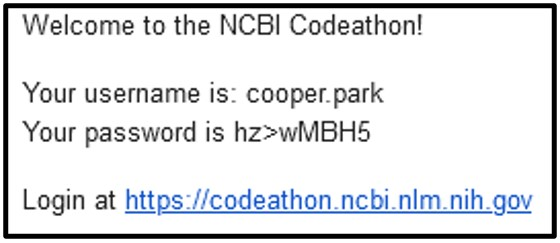
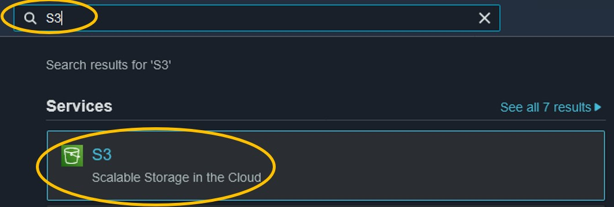

# Objective 0 - Logging in & Navigating the AWS Console Page

1) Find your credential email with subject: **NCBI Codethon Credentials**

2) Navigate to [https://codeathon.ncbi.nlm.nih.gov](https://codeathon.ncbi.nlm.nih.gov) and login using the credentials from the email *(left image)* and create a new passwrod after logging in *(right image)*

3) Click "Sign-In" under the AWS Console Sign-In column on the new page

4) If you see **AWS Management Console** like the screenshot below, you have successfully logged in to the AWS Console!

> **NOTE:** If you are logged out or get kicked out of the console, simply return to [https://codeathon.ncbi.nlm.nih.gov](https://codeathon.ncbi.nlm.nih.gov) and log in again (remember your newly created password!) to get back to the console home page.

> **NOTE:** This login method is unique to the workshop. If you want to create your own account after the workshop, visit the link below and follow the steps:
> [https://aws.amazon.com/premiumsupport/knowledge-center/create-and-activate-aws-account/](https://aws.amazon.com/premiumsupport/knowledge-center/create-and-activate-aws-account/)

# Objective 1 - Search for the sequence reads deposited into NCBI's SRA database using AWS Athena

## Creating an S3 Bucket

Before we can use Athena, we need to make an S3 bucket that we can save our results to as we search the SRA metadata tables. So, let's go make one!

1) Use the search bar at the top of the console page to search for **S3** and click on the first result

2) Click the orange **Create Bucket** button on the right-hand side of the screen

3) Enter a bucket name and make sure the region is set to `US East (N. Virginia) us-east-1`  
**S3 bucket names must be completely unique.** For this workshop, use the format `<username>-cloud-workshop` where `<username>` is the username you used to login

4) Scroll down to the **Block Public Access settings for this bucket** section. Deselect the blue checkbox at the top and select the bottom 2 checkboxes. Then check the box underneath the warning symbol to acknowledge your changes to the public access settings

5) Ignore the rest of the settings and scroll to the bottom of the page. Click the orange **Create Bucket** button.

> For more information about the settings we skipped, visit the supplementary text (section: **In-depth S3 bucket creation**)

6) Clicking the button will redirect you back to the main S3 page. You should be able to find your new bucket in the list. If so, you have successfully created an S3 bucket!

Now that we have an S3 bucket ready, we can go see what the Athen page looks like!

## Navigating to Athena
